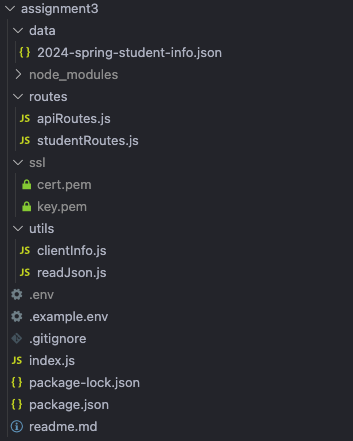

# Assignment3 Documentation

This API provides:

* GET  / to retrieve all the student-info
* POST /to retrieve your information based on 'student-id'
* POST /to retrieve student's info who has taken CS548 -> the result should be all students ( return student-id only)
* POST /to retrieve who has taken the courses you have taken except CS548.

## Configuration

Before starting the server, ensure that a `.env` file is created at the root of the project with the following contents as shown in .example.env:

```
PORT=YourDesiredPortNumber
DATA_PATH=PathToYourDataFile.json
```

**Required dependencies:** express, dotenv, https, and json5 for the application, as well as nodemon for development purposes

### For application

```
npm install express dotenv https json5
```

### For development

```
npm install --save-dev nodemon
```

## Base URL

The base URL for the API is:

```
http://localhost:{PORT}/sfbu/api/v1
```

Replace `{PORT}` with the actual port number specified in your `.env` file.

## Run Devlopment server

```
npm run dev
```

## Student Endpoints

### Retrieve All Students Information

**GET** `/students`

Retrieves a list of all students along with their details.

#### Response

- `200 OK` on success

```json
  {
    "studentInfo": [...], // Array of student objects
    "clientInfo": {
        "ip": "::1",
        "deviceType": "PostmanRuntime/7.36.3"
    } // Client information object
  }
```

### Specific Student Information

**POST** /students

Fetches information for a specific student based on the student ID provided in the query parameter.

**Query Parameters
***student_id*** (required): The unique identifier of the student.**

#### Response

- `200 OK` on success

```json
{
  "studentInfo": ["student_id1", "student_id2", ...],
  "clientInfo": {...} // Client information object
}
```

### Retrieve Students Who Have Taken a Specific Course

**POST** /students/findStudentsByCourse

Returns a list of student IDs for those who have enrolled in the specified course.

**Body Parameters**
***courseId*** (optional): The ID of the course. Defaults to "CS548" if not provided.

### Response

- `200 OK` on success

### Retrieve Students with Similar Coursework

**POST** /students/findSimilarStudents

Finds students who have taken the same courses as the specified student, excluding the course "CS548".

**Body Parameters**
***student_id*** (required): The unique identifier of the student.

#### Response

- `200 OK` on success

```json
{
  "studentInfo": [
    {
      "course_id": "CS501",
      "course_name": "Practical Application of Algorithms",
      "studentList": ["student_id1", "student_id2", ...]
    },
    // ... other courses and students
  ],
  "clientInfo": {...} // Client information object
}

```

- `404 Not Found `if the student ID is not provided or the student does not exist

```json
{
  "studentInfo": "Student not found!",
  "clientInfo": {...} // Client information object
}
```

## Project Structure


